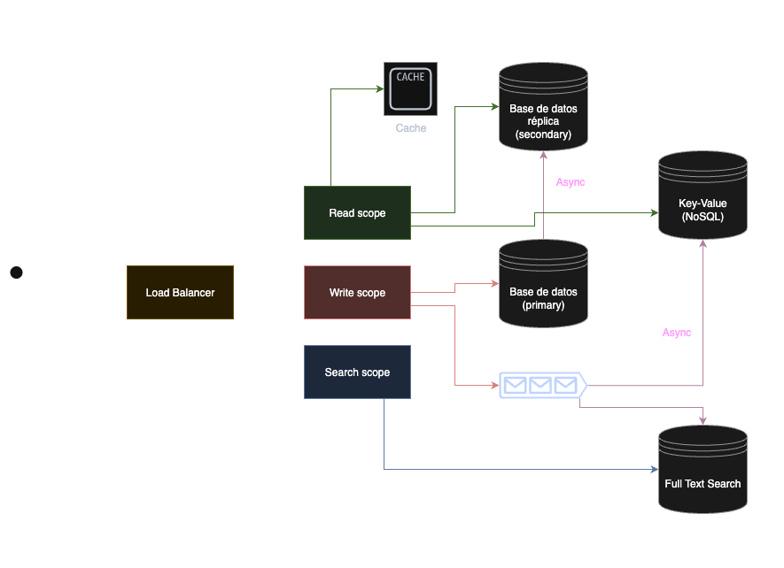

<div align="center">
<h3 align="center">twitter-challenge-exercise</h3>

  <p align="center">
    El objetivo de este proyecto es crear una versión simplificada de una plataforma de microblogging similar a twitter que
permita a los usuarios publicar, seguir y ver el timeline de tweets.
  </p>
</div>

### Construido con

* [Go](https://go.dev/) Lenguaje de programación
* [Gin-Gonic](https://github.com/gin-gonic/gin) Framework HTTP para la creación de la API REST
* [JWT](https://jwt.io/) Tokens de autenticación de usuarios 
* [MySQL](https://www.mysql.com/) Base de datos relacional

## 🚀  Como correr el proyecto

Para ejecutar localmente esta aplicación, hay que seguir los siguientes pasos:

### Prerequisitos

* [Docker](https://www.docker.com/) Necesario para ejecutar el container que contiene la aplicación, y una base de datos in memory

### Instalación

1. Clonar el repositorio
   ```sh
   git clone https://github.com/lpalumbo49/twitter-challenge-exercise.git
   ```
2. Ejecutar el contenedor mediante Docker
   ```sh
   docker compose up -d --build
   ```
3. Las credenciales de conexión a la base de datos y para la autenticación de usuarios, se encuentran en `./docker-compose.yml`
   ```yml
   # These should be handled as secrets, outside the scope of this application
   environment:
      - DATABASE_HOST=localhost
      - DATABASE_PORT=3306
      - DATABASE_USER=root
      - DATABASE_PASSWORD=password
      - DATABASE_NAME=twitter_db
      - JWT_TOKEN_SECRET=this_is_a_secret
   ```
4. Ejecutar en la base de datos (solo por única vez) los scripts presentes en `./scripts/db_creation_queries.sql`, para crear las tablas de la aplicación

5. La aplicación se ejecutará en el puerto 8080: `http://localhost:8080`


## 📡 Uso de la API

### Endpoints públicos

### Crear usuario
Crea un nuevo usuario.
```
POST /api/v1/user
```
#### Request
  ``` json
  {
    "name": "Nombre",
    "surname": "Apellido",
    "email": "email@test.com",
    "password": "super-safe-password",
    "username": "nombre_de_usuario"
  }
  ```
#### Response
  ``` json
  {
    "id": 49,
    "name": "Nombre",
    "surname": "Apellido",
    "email": "email@test.com",
    "username": "nombre_de_usuario",
    "created_at": "2025-07-09T00:00:00Z",
    "updated_at": "2025-07-09T00:00:00Z"
  }
  ```

### Login de usuario
Realiza el login de un usuario existente. Devuelve el token JWT que luego deberá ser utilizado para poder acceder a los métodos privados de la API.
```
POST /api/v1/login
```
#### Request
  ``` json
  {
    "email": "email@test.com",
    "password": "super-safe-password"
  }
  ```
#### Response
  ``` json
  {
    "token": "dgsfkjhgdfsjkh534kj543kjhfdskjh5234bnfdskj5432jk"
  }
  ```
### Endpoints privados
A partir de aquí, los siguientes métodos requieren todos ser autenticados con el header `Authorization: Bearer {token}` para poder ser utilizados, con el token generado en el método `/login`.

### Get de usuario por ID
Obtiene un usuario por su ID.
```
GET /api/v1/user/:id
```
#### Response
  ``` json
  {
    "id": 49,
    "name": "Nombre",
    "surname": "Apellido",
    "email": "email@test.com",
    "username": "nombre_de_usuario",
    "created_at": "2025-07-09T00:00:00Z",
    "updated_at": "2025-07-09T00:00:00Z"
  }
  ```

### Modificación de usuario
Modifica los campos de un usuario por ID. Por simplicidad de diseño, deben enviarse todos los campos del body.
```
PUT /api/v1/user/:id
```
#### Request
  ``` json
  {
    "id": 49,
    "username": "nombre_de_usuario",
    "name": "Nombre",
    "surname": "Apellido"
  }
  ```

#### Response
  ``` json
  {
    "id": 49,
    "name": "Nombre",
    "surname": "Apellido",
    "email": "email@test.com",
    "username": "nombre_de_usuario",
    "created_at": "2025-07-09T00:00:00Z",
    "updated_at": "2025-07-09T00:00:00Z"
  }
  ```

### Search de usuarios
Realiza el search de todos los usuarios. Este método podría ampliarse para implementar funcionalidades de full-text search.
```
GET /api/v1/users
```
#### Response
  ``` json
  {
    "users": [
      {
        "id": 49,
        "name": "Nombre",
        "surname": "Apellido",
        "email": "email@test.com",
        "username": "nombre_de_usuario",
        "created_at": "2025-07-09T00:00:00Z",
        "updated_at": "2025-07-09T00:00:00Z"
      },
      {
        "id": 50,
        "name": "Otro Nombre",
        "surname": "Otro Apellido",
        "email": "otro_email@test.com",
        "username": "otro_nombre_de_usuario",
        "created_at": "2025-06-10T00:00:00Z",
        "updated_at": "2025-06-10T00:00:00Z"
      }
    ]
  }
  ```

### Creación de tweet
Crea un nuevo tweet.
```
POST /api/v1/tweet
```
#### Request
  ``` json
  {
    "user_id": 49,
    "text": "Este es el texto de un tweet. Tiene un máximo de 280 caracteres."
  }
  ```
#### Response
  ``` json
  {
    "id": 126,
    "user_id": 49,
    "text": "Este es el texto de un tweet. Tiene un máximo de 280 caracteres",
    "created_at": "2025-07-09T00:00:00Z",
    "updated_at": "2025-07-09T00:00:00Z"    
  }
  ```

### Get de tweet por ID
Obtiene un tweet por su ID.
```
GET /api/v1/tweet/:id
```
#### Response
  ``` json
  {
    "id": 126,
    "user_id": 49,
    "text": "Este es el texto de un tweet. Tiene un máximo de 280 caracteres",
    "created_at": "2025-07-09T00:00:00Z",
    "updated_at": "2025-07-09T00:00:00Z"       
  }
  ```

### Modificación de tweet
Modifica el texto de un tweet. Solo puede realizar esta operación el usuario que haya creado al tweet.
```
PUT /api/v1/tweet/:id
```
#### Request
  ``` json
  {
    "id": 126,
    "user_id": 49,
    "text": "Este es un texto modificado"
  }
  ```
#### Response
  ``` json
  {
    "id": 126,
    "user_id": 49,
    "text": "Este es un texto modificado",
    "created_at": "2025-07-09T00:00:00Z",
    "updated_at": "2025-07-10T00:00:00Z"         
  }
  ```

### Obtener el timeline de un usuario
Obtiene el timeline del usuario, que consiste en los tweets de los usuarios que él sigue, ordenados decrecientemente por fecha de creación.
El ID de usuario corresponderá al que esté autenticado.
```
GET /api/v1/timeline
```
#### Response
  ``` json
  {
    "timeline": [
      {
        "id": 126,
        "user_id": 49,
        "text": "Este es el texto de un tweet. Tiene un máximo de 280 caracteres",
        "created_at": "2025-07-09T00:00:00Z",
        "updated_at": "2025-07-09T00:00:00Z",
        "user": {
          "id": 49,
          "name": "Nombre",
          "surname": "Apellido",
          "email": "email@test.com",
          "username": "nombre_de_usuario",
          "created_at": "2025-07-09T00:00:00Z",
          "updated_at": "2025-07-09T00:00:00Z"        
        }
      },
      {
        "id": 96,
        "user_id": 50,
        "text": "Este es un un tweet de otro usuario que me interesa",
        "created_at": "2025-07-01T00:00:00Z",
        "updated_at": "2025-07-01T00:00:00Z",
        "user": {
        "id": 50,
          "name": "Otro Nombre",
          "surname": "Otro Apellido",
          "email": "otro_email@test.com",
          "username": "otro_nombre_de_usuario",
          "created_at": "2025-06-10T00:00:00Z",
          "updated_at": "2025-06-10T00:00:00Z"        
        }    
      }
    ]
  }
  ```

### Crear follower de usuario
Crea un follower de usuario. Es decir, una asociación entre un usuario y el usuario que le interesa seguir.
```
POST /api/v1/follower
```
#### Request
  ``` json
  {
    "user_id": 50,
    "followed_by_user_id": 49
  }
  ```
#### Response
  ``` json
  {
    "user_id": 50,
    "followed_by_user_id": 49,
    "created_at": "2025-07-09T00:00:00Z"    
  }
  ```
### Errores

En caso de que una respuesta no sea satisfactoria, se devolverá el siguiente formato:
#### Response
  ``` json
  {
    "message": "descripción del error"
  }
  ```

### Response codes

* `200` OK. Respuesta correcta para todo tipo de requests, excepto los de creación
* `201` Created. Respuesta correcta para solicitudes de creación (`POST`)
* `400` Bad request. Respuesta ante datos erróneos que envía el cliente en una solicitud
* `401` Unauthorized. Respuesta de endpoints privados, en los cuales el cliente no se ha autenticado
* `403` Forbidden. Respuesta que indica que el cliente no se encuentra autorizado a realizar determinada acción
* `404` Not found. Respuesta ante solicitudes de búsqueda que no arrojan resultados
* `500` Internal server error. Respuesta ante errores internos del sistema. No es un error del cliente

## 📁 Estructura del proyecto

   ```sh
.
├── Dockerfile
├── docker-compose.yml
├── go.mod                      # Módulos y dependencias en libraries de la aplicación
├── go.sum
├── cmd/
│   └── api/
│       └── main.go             # Punto de entrada y ejecución de la aplicación
├── docs/                       # Imágenes que se utilizan en esta documentación
├── internal/                   # Código privado de la aplicación
│   ├── adapter/                # Implementaciones de los métodos genéricamente definidos en los ports
│   │   ├── handler/            # Métodos expuestos para comunicación entrante y saliente con clientes 
│   │   │   └── http/           # Comunicación REST
│   │   │       └── dto/        # Métodos de transformación de entidades de comunicación a entidades de negocio
│   │   │       └── middleware/ # Implementación de middleware de autenticación
│   │   └── repository/         # Métodos relacionados a implementaciones de almacenamiento (base de datos)
│   ├── config/                 # Lectura de configuraciones de entorno
│   ├── container.go            # Wiring (inyección) de dependencias
│   └── core/                   # Código relacionado al dominio de la aplicación
│       ├── domain/             # Entidades y modelos de negocio
│       ├── port/               # Definición de interfaces para la comunicación entre el mundo exterior y el core
│       └── service/            # Casos de uso propiamente dichos
├── pkg/                        # Libraries y gestión de errores. Podría implementarse en un repositorio toolkit
├── scripts/                    # Scripts SQL de creación de tablas
└── README.md

   ```

Este proyecto sigue una organización basada en los principios de la _Arquitectura Hexagonal_ (también llamada _Ports y Adapters_), permitiendo una alta separación de responsabilidades, facilidad de testeo, y escalabilidad.
Resumidamente, los tres actores principales en esta arquitectura son:

* Core: El core es la lógica principal de la aplicación. Contiene todas las reglas de negocio y funcionamiento propiamente dicho de la misma.
* Port: Un port es un contrato que define como la aplicación se comunicará con sistemas o servicios externos.
* Adapter: El adapter es una implementación concreta de un port. Posee el detalle técnico necesario para cumplir un contrato en particular.

Esto permite que las `interfaces` de golang puedan ser aprovechadas para inyección de dependencias, que permite el fácil desacople y cambio de módulos de la aplicación (por ejemplo motor de persistencia, punto de entrada de HTTP a Kafka, etc) muy fácilmente. Además, cada componente del core puede testearse de forma aislada, utilizando mocks de sus puertos.

Los `handlers` HTTP analizan las solicitudes HTTP entrantes, validan su formato y autenticación, y responden a los clientes con los códigos de estado definidos en el estándar REST.
Los handlers se comunican con el `core` de la aplicación mediante la implementación de los ports (`services`), que manejan la lógica de negocio.
Los services acceden a la capa de persistencia mediante los `repositories`.

## 🧪 Testing

Este proyecto incluye algunos ejemplos de tests unitarios para los servicios de usuarios y tweets, y tests de integración para probar la implementación del servicio de tweets. 

### Ejecutar todos los tests:
   ```sh
   go test -v ./...
   ```
### Ejecutar tests unitarios:
   ```sh
   go test -v ./internal/core/service
   ```
### Ejecutar tests de integración:
   ```sh
   go test -v ./internal/adapter/handler/http
   ```

## 🏗️ Arquitectura

La arquitectura actual de la solución consta en un servicio web, que es llamado desde un cliente. El servicio se comunica con una única instancia de base de datos, y todas las operaciones son sincrónicas.
Se eligió implementar una base de datos MySQL por su sencillez de implementación, y su performance en lecturas. A medida que el sistema escale en tamaño, podrá llegar a ser más conveniente la utilización de PostgreSQL, con mayor performance para queries complejas y robustez en datasets grandes.


Si bien esto es funcional y cumple con los requerimientos de negocio, a largo plazo no es escalable en el tiempo debido a que está todo concentrado en un solo punto de falla. Una afectación en la base de datos dejaría sin sistema a todos los usuarios, o mismo una ráfaga de tráfico de operaciones de escritura terminaría repercutiendo en la performance de operaciones de lectura, por dar unos ejemplos.

Por ende, una posible solución es separar el tráfico en diferentes grupos de instancias de aplicaciones (que denominaremos _scopes_), basándonos en el tipo de operación (lectura, escritura, o búsqueda masiva), y balancear el tráfico según corresponda. Las instancias de los scopes pueden escalar horizontalmente en base a la demanda de tráfico que reciban.

Además, operaciones como la obtención del timeline pueden llegar a ser muy costosas si la cantidad de información es amplia. Sería más eficiente en lectura poder leer un timeline ya resuelto previamente, por lo que un enfoque es ir resolviendo el timeline de usuarios asincrónicamente, y almacenándolo luego. El timeline también puede implementar una lógica de paginación, para evitar consultar una gran cantidad de datos en una sola petición.

La complejidad que se agrega es la necesidad de mantener sincronizados los datos en todos los frentes, pero también depende del grado de consistencia eventual que se esté dispuesto a aceptar.



En el contexto de este ejercicio los tweets no pueden almacenar imágenes o videos, pero en caso de poder hacerlo se podría agregar un CDN, para la rápida distribución multimedia a usuarios.
Y además, el scope de escritura se encargaría de guardar las mismas en un servicio de Media Store.

### Descripción de los componentes
* Load balancer: Balanceador de carga, que también cumple funciones de API Gateway. Se encarga de redirigir el tráfico al scope que corresponda.
* Read scope: Operaciones de lectura, de tweets, usuarios y timeline. Se encarga también de actualizar la caché de búsqueda. El orden de búsqueda de información sería el siguiente:
  1) Caché
  2) Key-Value
  3) Base de datos réplica
* Write scope: Operaciones de escritura, de tweets, usuarios y timeline. Envía eventos asincrónicos por cola de mensajería, para mantener actualizados los otros tipos de storage.
* Search scope: Búsquedas de datos, según filtros más avanzados de búsqueda.
* Base de datos (primary): Fuente de verdad principal de la información.
* Base de datos réplica (secondary): Réplica de la base principal, que se utiliza para alivianarle la carga, y solo acepta operaciones de lectura.
* Cache: Mejora la velocidad de respuesta de las lecturas de tweets y usuarios más utilizados.
* Key-Value (NoSQL): Almacena los timelines precalculados de los usuarios, para su rápida obtención.
* Full Text Search: Storage optimizado para búsquedas según diversos criterios (email, nombre de usuario, etc)
* Queue: Broker de mensajería que se encarga de comunicar eventos de actualizaciones asincrónicas. Implementa lógica de reintentos.

## 🤝 Contacto

Link del proyecto: [https://github.com/lpalumbo49/twitter-challenge-exercise](https://github.com/lpalumbo49/twitter-challenge-exercise)

